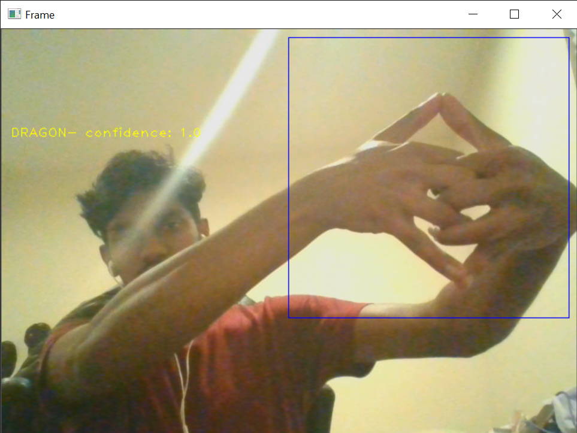
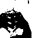
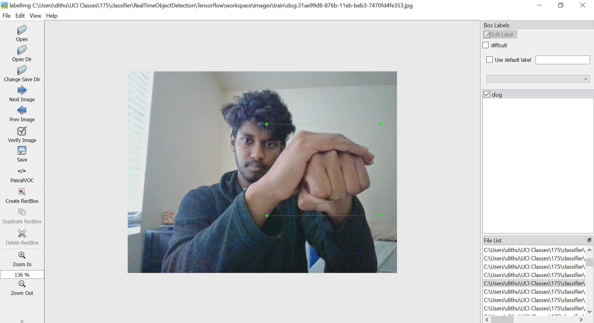

# {{ page.title }}

<iframe src="https://spark.adobe.com/video/3di9v2kcH6UWh/embed"  width="960" height="540" frameborder="0" allowfullscreen></iframe>

## Project Summary:
The Wizard attempts to control a Malmo agent through Naruto hand signs. In Naruto, there are several hand signs (tiger, bird, dog, etc.) that correspond to a certain spell. The Wizard will take in live camera input, utilize deep learning to classify that input as one of the 12 different Naruto hand signs, and instruct the agent to execute a corresponding action. Initially, this project was built to accurately classify not only static gestures, but continuous hand movements as well. However, as time progressed we realized that it would be incredibly difficult to implement this feature within the given time. Instead we chose to implement a model that would remove the requirement of a region of interest and instead implemented detection of signals on a hand in picture basis.

## Approaches:
Throughout the development of The Wizard, we wanted to create a functional deep learning model with minimal overhead and the ease of simple design. We did some research as to how the problem of gesture recognition was tackled in the past, and we found that it boiled down to two steps: image segmentation and image classification.

In order to effectively filter the images to only capture our gestures, we started with a few simple steps. First, we established a ROI (region of interest) within the live camera input, and placed it in the top right corner, as seen below:

This was done with the hopes of reducing the amount of background noise when later isolating the hands. For example, if the box had been placed over the user’s body, it would be much harder to segment the image. Then, we used opencv to apply a threshold over the image in order to only capture the gestures. This resulted in images as shown below:

Through this process, we manually created a dataset for our image classification model. To further prepare the data, we split the images up into test and train folders. We made sure to keep equal amounts of all class types within both folders.

To classify these images as naruto hand signs, we utilized a convolution neural network, similar to the graphic below:

This classification technique proved to produce the most accurate results. The snippet shows the internal workings of our model.

Initially we began with using a simple keras CNN or Convolutional Neural Network and found that when there was no hand in the ROI, that our algorithm would still produce output. This is when our team realized that a simple framework like the one we had created wouldn't cut it. With the Tensorflow Object Detection API, we created a model that is accurate up to a certain extent with less classes and more features. 

First we took the dataset we created and used labelimg to create json files adjacent to each jpeg image we captured. labelimg allowed us to manually create boxes around each image and create json output that the object detection API can read.

Next we chose a version of my_ssd_mobnet to use with the Tensorflow Object Detection API and modified the pipeline.config file with the appropriate parameters. Then we trained the model for {10k, 20k, and 30k} epochs and noticed that 10k was underfitting the model and that 30k was overfitting the model aggressively.

(put a chart that shows this.).

During the creation of our status report we initially had an incredibly naive and simple implementation of Naruto style “jutsu” mechanics in regards to the result of activating those spells. To quell that issue, we implemented a way that would target the closest “mob” or NPC with the spell. In addition, we added a plethora of spells that would stay true to how it worked in the Naruto Anime by making it combinations of signs instead of one sign.

(show different spells)
(/ summon lightning (chidori))
(/ summon dog (dog dude from naruto)

## Evaluation:
Throughout our project much of the criticism we received from our status report was in regards to how we would do our evaluation within Malmo. While we may have not addressed this we strongly believe that our Algorithm holds more importance over a mode of evaluation in Malmo and found that by testing the number of epochs and hypertuning our parameters over time we found an optimal solution towards detecting differences in our input.

## References:
Here are some of the resources that helped us in this project
* [Keras documentation: Conv2D layer](https://keras.io/api/layers/convolution_layers/convolution2d)
* [Naruto hand sign dataset](https://www.kaggle.com/vikranthkanumuru/naruto-hand-sign-dataset)
* [Naruto hand sign fast detection FastAI](https://www.kaggle.com/vikranthkanumuru/naruto-hand-sign-detection-fastai-using-vgg19)
* [Sign language recognition using Python & OpenCV](https://data-flair.training/blogs/sign-language-recognition-python-ml-opencv)
* [Build your own object detection model using tensorflow api](https://www.analyticsvidhya.com/blog/2020/04/build-your-own-object-detection-model-using-tensorflow-api/)