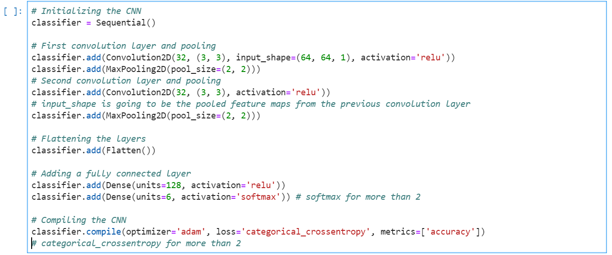
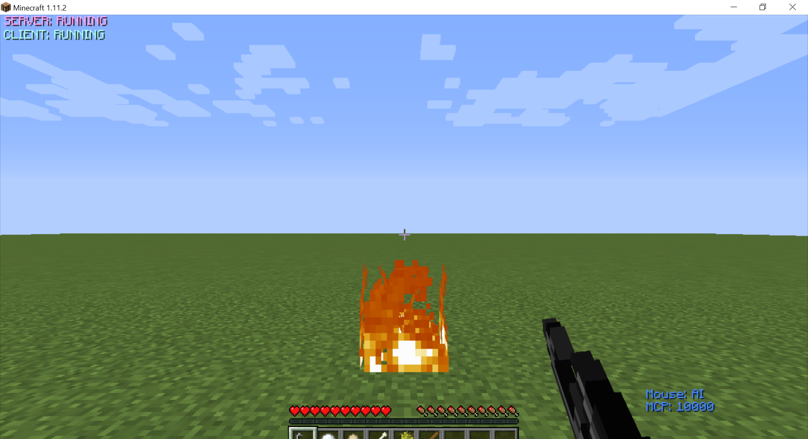
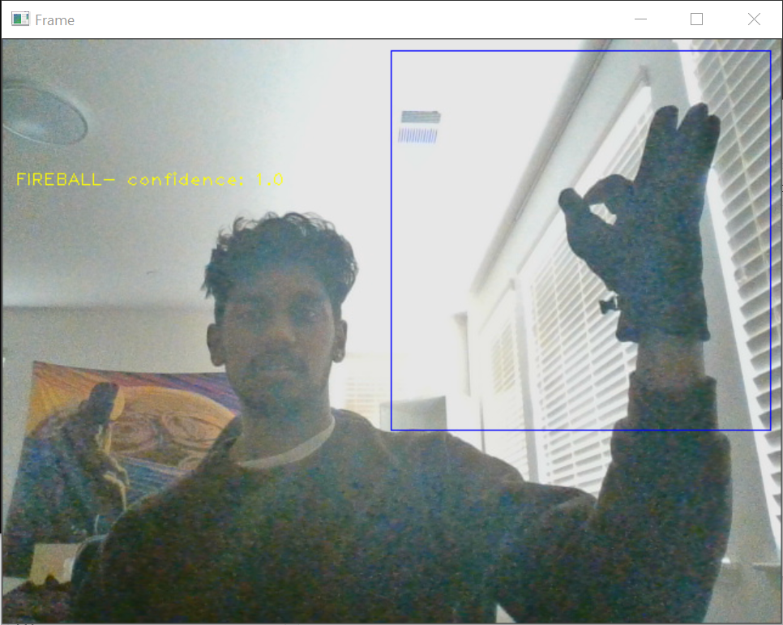
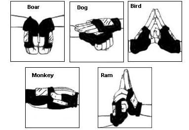

# {{ page.title }}

<iframe src="https://spark.adobe.com/video/3di9v2kcH6UWh/embed"  width="960" height="540" frameborder="0" allowfullscreen></iframe>

## Project Summary:
The Wizard attempts to control a Malmo agent through Naruto hand signs. In Naruto, there are several hand signs (tiger, bird, dog, etc.) that correspond to a certain spell. The Wizard will take in live camera input, utilize deep learning to classify that input as one of the 12 different Naruto hand signs, and instruct the agent to execute a corresponding action. Our final goal for this project is to build a model that can accurately classify not only static gestures, but continuous hand movements as well. However, for this first checkpoint, our model is only equipped to classify static images. 

## Approach:
Throughout the development of The Wizard, we wanted to create a functional deep learning model with minimal overhead and the ease of simple design. We did some research as to how the problem of gesture recognition was tackled in the past, and we found that it boiled down to two steps: image segmentation and image classification.

In order to effectively filter the images to only capture our gestures, we started with a few simple steps. First, we established a ROI (region of interest) within the live camera input, and placed it in the top right corner, as seen below:

This was done with the hopes of reducing the amount of background noise when later isolating the hands. For example, if the box had been placed over the user’s body, it would be much harder to segment the image. Then, we used opencv to apply a threshold over the image in order to only capture the gestures. This resulted in images as shown below:

Through this process, we manually created a dataset for our image classification model. To further prepare the data, we split the images up into test and train folders. We made sure to keep equal amounts of all class types within both folders.

To classify these images as naruto hand signs, we utilized a convolution neural network, similar to the graphic below:

This classification technique proved to produce the most accurate results. The snippet shows the internal workings of our model.

The model allowed us to achieve high classification accuracy on naruto hand sign test dataset.

The last step of our project was relating these predictions to the Malmo agent. For the purposes of this checkpoint, we kept the Malmo functionality somewhat barebones. We aimed to generate Malmo actions that intuitively follow from the Naruto hand signs. For example, the “fireball” hand sign simply lights the ground on fire with a flint and steel.

To see more of the Malmo functionality, please check out our video for a more in-depth demo.

## Evaluation:
One method of evaluation would be to test our models performance in different settings. Throughout the creation of the model, we noticed that models trained in one persons room with different camera specifications would result in different outputs on other peoples machines. To nullify the solution our code allows the creation of test and training data.

In the figure above, we demonstrate one way we counteract this issue, as the image in the box is a fireball and we have used black gloves to test and see how this works within the model. By training the model on varying data, we can determine the loss and accuracy of the model per epoch. 
* Currently there are five different complex hand signals that we use to determine (jutsu’s) or “commands” for Steve to perform.
* Bird, Tiger, Horse, Dragon, Fireball (Sasuke’s signature ability).

* In the future we plan to implement more methods and jutsu’s into our network. 
* In addition, we plan to further develop our model to be more accurate, moving away from grayscale to regular images, and porting over to tensorflow and using their object-detection API.
* Currently, if you hold a pose for 6 time units straight it will consider the command run - we plan to make this more consistent without having to deal with random error in regards to our prediction output.

Using a standard test-train split we can achieve an upwards of a 98% accuracy with testing data. Our test data size is relatively small with 30 images for validation, and 1173 images for our training data. Finally, after performing the evaluation on the test data, we focused on optimizing our algorithm for all environments. We may add a layer where we do background removal to remove the redundancy and error in the future.

## Remaining Goals / Challenges:
With regards to our static image classification model, there are a few basic remaining challenges. Firstly, we did not get to implement all of the Malmo functionality required to truly execute the Naruto spells. By the final project, we hope to control the agent in a way that lives up to the name of our project. We do not anticipate this will be particularly difficult, and will simply require some additional effort on the Malmo side.

Secondly, while our model is highly accurate with normal lighting and a clear background, different lighting conditions and noisier backgrounds give the model some difficulty. There are a couple different ways we can combat this problem, starting with collecting more data. Thus far in this project, we have trained the model using data that we have generated. However, most of this image data was captured around roughly the same time, so there is not much variance in the images. Gathering more data, whether it be through online sources, or by making more ourselves, will help the model make its classifications. Thus far, we have already seen major improvements in accuracy after feeding in more training data. Another way we can solve this problem is by utilizing better image segmentation techniques when isolating the user’s hands from the background. We don’t anticipate this to be very difficult, as opencv offers a variety of functions that can help with this problem. For example, we can attempt to isolate the hands through edge detection in addition to our existing image segmentation techniques.

Our biggest remaining challenge will be to adjust our model to classify continuous motions. This remaining portion of our project presents issues on multiple ends. We will need a new data set consisting of GIF or video-like content in order to train our model. While generating data may take an immense amount of time, it can be accomplished through our collective efforts. 

We will also need a way of parsing this new data format, and will need to modify our classification process in order to fit the new data type. In terms of the magnitude of changes that we must perform, this seems like a problematic task. However, we have some ideas as to how we can attempt to overcome these difficulties. If we treat a video as a series of frames, we can attempt to split up the video into chunks, and sample a frame from each chunk. Then, we can retrain our model to look for different image patterns at different times. Finally, we can use this retrained model to classify each section, and then average across the different assigned labels to classify the entire clip. While this may seem like a somewhat rudimentary approach, it is worth a try as we can use parts of our existing model to do so. However, if this fails, we can look into some of the existing research into this area and try to follow their examples.

## Resources used:
Here are some of the resources that helped us in this project
* [https://keras.io/api/layers/convolution_layers/convolution2d/]
* [https://www.kaggle.com/vikranthkanumuru/naruto-hand-sign-dataset]
* [https://www.kaggle.com/vikranthkanumuru/naruto-hand-sign-detection-fastai-using-vgg19]
* [https://data-flair.training/blogs/sign-language-recognition-python-ml-opencv/]